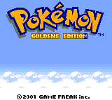

# Deutsch für Pokémon Gold

Deutsche Übersetzungs-Mod für die Gold-Unterstützung von Gen1Recomp. Sie
ersetzt die Texte und Namen der importierten US-Version durch die Inhalte der
offiziellen deutschen **Goldenen Edition** und übernimmt die dazugehörige
Schrift, Titelgrafik sowie die übersetzten Außenbeschriftungen von Pokémon-
Center und Markt.

## Enthalten

- 3.042 Dialog- und Systemtexte sowie zwei leere ROM-Sentinel-Einträge
- deutsche Pokémon-, Attacken-, Item-, Trainerklassen- und Ortsnamen
- deutsche Attacken- und Itembeschreibungen
- vollständige deutsche Pokédex-Einträge mit metrischen Größenangaben
- Originalschrift mit Umlauten und `ß`
- Titelbild `GOLDENE EDITION` mit bereinigtem `N`
- deutsche Center-/Markt-Grafiken in Johto und Kanto

## Voraussetzung

- Gen1Recomp `0.1.90` oder neuer mit Gold-Unterstützung
- eine vom Spieler selbst importierte, unterstützte US-ROM von Pokémon Gold

Die Mod enthält keine ROM und verändert keine ROM-Datei. Pokémon Silber wird
erst separat ergänzt, sobald die Silber-Unterstützung und eine geprüfte
Silber-Datenbasis verfügbar sind; große Teile der Texte sind gleich, die
versionsspezifischen Grafiken und einzelne Dialoge aber nicht.

## Installation

Den Release als ZIP bzw. Mod-Paket über den Mod-Manager installieren und nur
für **Gold** aktivieren.

## Entwicklung

Die Kataloge wurden durch strukturelles Zuordnen der englischen und deutschen
Gold-Daten erstellt. Private ROM-Dateien, Rohdaten und Extraktions-Caches sind
absichtlich nicht Bestandteil dieses Repositorys.
